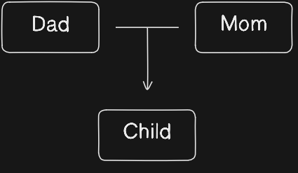

# Estrutura de Dados e Algoritmos

<!-- See https://www.w3schools.com/dsa/dsa_intro.php -->

> Teoria sobre Estrutura de Dados e Algoritmos (DSA)
>
> Os algoritmos práticos estarão dispostos no diretório **source**

 

## Estrutura de Dados

Uma estrutura de dado pode ser descrita como a forma como informações são armazenadas.\
Um exemplo de estrutura de dado que podemos utilizar são as árvores genealógicas:

 

As diferentes **Estruturas de Dados** auxiliam na criação de algoritmos mais eficazes para diferentes cenários, manejando e organizando os dados de modo a reduzir a complexidade e aumentar a eficiência.\
Elas são uma forma de armazenar e recuperar informações de forma eficiente para resolver problemas específicos.

Cada **Algoritmo** deve trabalhar para resolver uma tarefa específica, utilizando da estrutura de armazenamento e tratamento que melhor convir para aquele caso. Ambos devem trabalhar em consonância.

 

## Sequência de Fibonnacci

O Fibonnacci é uma *Série Numérica*. Os dois primeiros números da série normalmente são o *0* e *1*, sendo os seguintes a soma dos dois valores anteriores.

- Sequência Desejada: 0, 1, 1, 2, 3, 5, 8, 13, 21, 34, 55...

> Algoritmo: ./source/fibonnacci.c

 

## 
